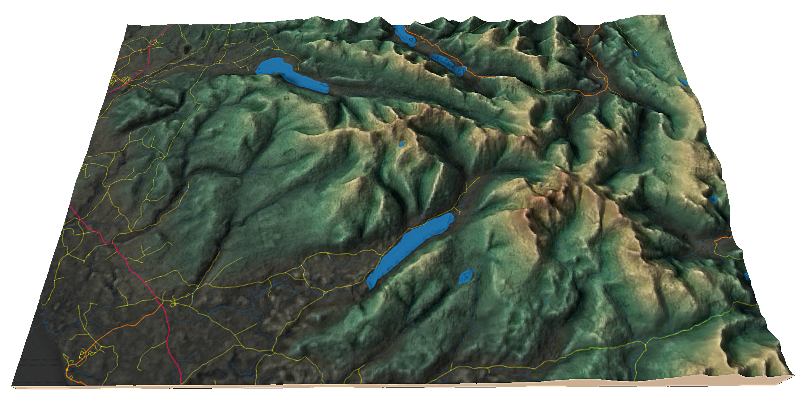
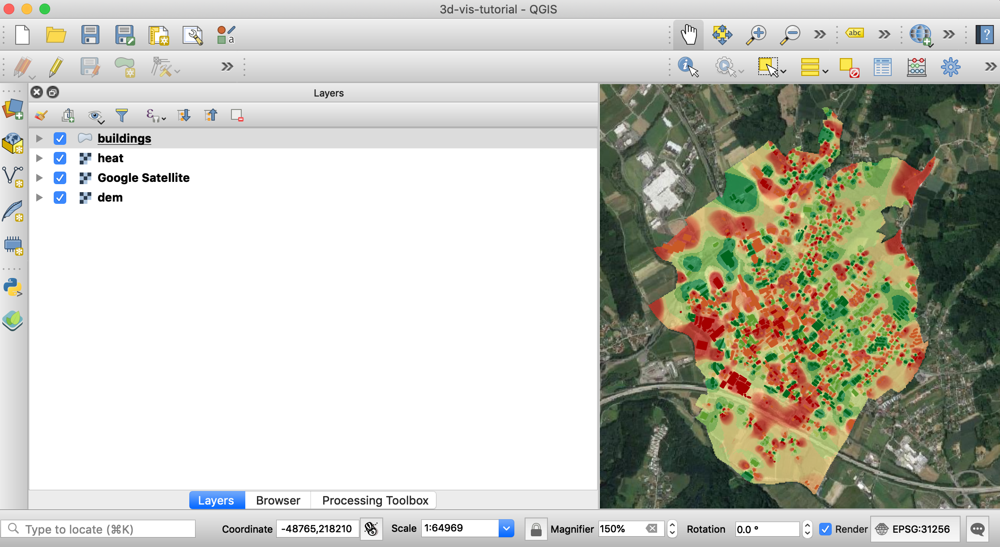
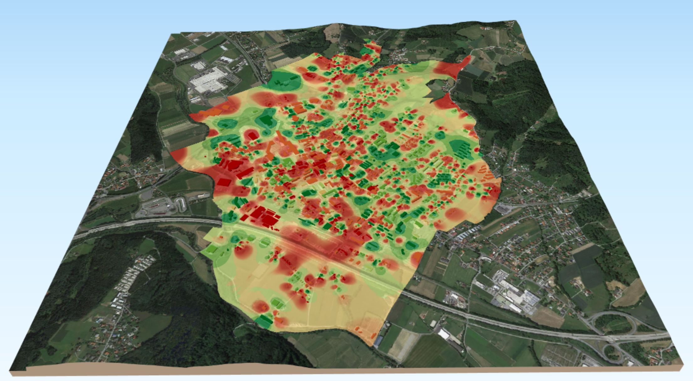
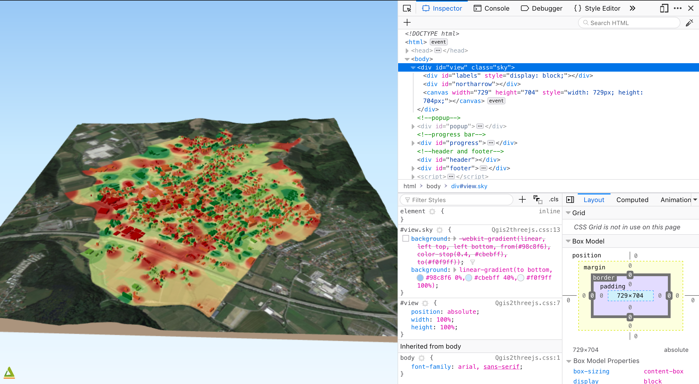

[QGIS](https://www.qgis.org/de/site/) is an excellent open-source spatial analysis tool that packs a real punch! Not only can you access a host of spatial algorithms to analyse your data, but you can now also start embarking into the exciting world of 3D data visualisation!

## `QGIS2ThreeJs` - essential 3D geovisualisation

To get started, download the `QGIS2ThreeJs` [plugin ](https://qgis2threejs.readthedocs.io/en/docs/)written by Minoru Akagi (*you can do so under the plugin directory inside QGIS*). This plugin will turn any of your rasters and shapefiles loaded in QGIS into a pretty 3D visualisation which you can implement on your own website or web-mapping application in an instant.


**Image Source**: *[Lazlo Woodbine](https://www.flickr.com/photos/lazlowoodbine/26187737260/in/photolist-FU7ZVo-EEUSk7-FkrSq5-FkjBbk-FiFMKr-FpHyDS/)*

## Getting started

In order for this to work you need at minimum either a Digital Elevation Model and a shapefile which contains an attribute which you wish to use to define height. 

If you do not have your own data you can download the data used for this tutorial in this [GitHub repository](https://github.com/samkellerhals/3d-visualisation-tutorial), and open the associated QGIS project. 

Once all the data is in place we should now also load some satellite imagery as we will be using this as a basemap for our 3D model later on. To do this go to browser, select XYZ tiles and add a new connection. In our case we will add Google Satellite data by adding in the following information:

```text
Name: Enter a name for your layer
URL: https://mt1.google.com/vt/lyrs=s&x={x}&y={y}&z={z}
```

Finally, make sure that the extent of your map canvas is completely filled by your map content, as any extra white spacing will also be rendered by the 3D model which we do not want. Your canvas should now look something like this:



We're now ready to start building our model!

### Building our 3D model

1. Open the `QGIS2ThreeJs` plugin.<br><br>
2. Under `DEM` input our digital elevation model (specify our heat model shapefile and your google satellite data under image layers). Here also set the resolution to the maximum, and enable building sides and shading.<br><br> 
3. Under `Shapefiles` select the building geometry data and set the height attribute to `building_height` and set it relative to DEM. To make all our buildings visible, in the height field specify the following expression: `"building_height" * 7`. Feel free to adjust this parameter as you want. 
4. You can now export the 3D rendering to a `index.html` file, saving it in a folder of your choice. 
5. Once exporting is finished, open this `index.html` file in your browser and you should see something similar to this:



## Extending our 3D model

You can modify the appereance of the `QGIS2ThreeJs` output by writing some targeted `html` and `css` code. 

This can be espescially useful if you are wanting to make a custom legend for your 3D model and change the model's size and positioning on the page as we will be doing today. 

### Introduction to developer tools

Every website on the internet today makes use of the following three core technologies: `HTML, CSS and JavaScript`. If you want to understand what code is responsible for what on any given webpage, it is often as easy as inspectin the source code using your browser's `developer tools`.

This will pull up a toolbar breaking down the structure of the website you are inspecting and then allows you to modify the existing code at your own will - this feature is espscially useful when debugging your own website. In our case we are using it to understand the structure of the website outputted by Minoru Akagi's plugin so we can make our own custom modifications to the appearance.



I have gone ahead and looked through the structure of these automatically generated 3D models previously, so will now simply guide you through some very basic changes - namely adding a legend, title and changing the positioning of the 3D model on the page. 

### Editing our 3D model source code

Open the folder in which the source code for your 3D model is located. We will start by editing the `Qgis2threejs.css` file. First thing will be to create a container for our 3D model, center it vertically, and change the background color. To do that add the following code below to your css file. 

```css
canvas {
  max-width: 700px !important;
  max-height: 500px !important;
  position: absolute;
  left:0; 
  right:0;
  top:0; 
  bottom:0;
  margin: auto;
  max-width:100%;
  max-height:100%;
  overflow:auto;
  border: solid #b2b2b2 1px;
  border-radius: 1%;
}

/*edit the exisiting css selectors to reflect these changes*/

#view.sky {
  background-color: black;
}

body {
  overflow: hidden;
  background-color: black;
  font-family: 'Roboto', sans-serif;
}

#view {
  position: absolute;
  height: 90%;
  width: 100%;
}

```
Now we can move on to adding our title, as well as our side-panel which will contain our legend. To do this we now need to edit the actual `index.html` file to add these elements to it. 

Add a title like so:

```html
<div id='map-title'>
<h1>Our extended 3D model</h1>
</div>
```

To add our legend it is very important that the following code is added after the `div` with `id="view"`.

```html
<!-- adding our legend -->
<div id='side-panel'>
  <div id="legend-container">
    <h2>Legend</h2>
    <div id="legend">
      <h5>Heatdemand in kWh/m<sup>2</sup>/a</h5>
      <ul>
        <li>
            <div class="legend-box" id="cat1"></div>
            <div class="cat-text">0 - 60<div>
        </li>
        <li>
            <div class="legend-box" id="cat2"></div>
            <div class="cat-text">60 - 90<div>
        </li>
        <li>
            <div class="legend-box" id="cat3"></div>
            <div class="cat-text">90 - 125<div>
        </li>
        <li>
            <div class="legend-box" id="cat4"></div>
            <div class="cat-text">125 - 145<div>
        </li>
        <li>
            <div class="legend-box" id="cat5"></div>
            <div class="cat-text">145 - 180<div>
        </li>
        <li>
            <div class="legend-box" id="cat6"></div>
            <div class="cat-text">> 180<div>
        </li>
      </ul>
    </div>
  </div>
</div>
```

We also need to delete the following lines:

```html
<div id="footer"><span id="infobtn"></span></div>

<div id="northarrow"></div>
```

Now we go back and add the remaining changes to our CSS to style our legend.

```css
/* variable definition */

:root {
  --cat1-col: #1a9850;
  --cat2-col: #91cf60;
  --cat3-col: #d9ef8b;
  --cat4-col: #fee08b;
  --cat5-col: #fc8d59;
  --cat6-col: #d73027;
}

#side-panel {
  width: 15em;
  position: absolute;
  height: 100vh;
  top: 0;
  left: 0;
  color: white;
  margin-left: 1em;
}

#legend-container {
  position: relative;
  top: 50%;
  transform: translateY(-50%);
}

#side-panel h2 {
  text-align: center;
  font-size: 2em;
}

#side-panel h5 {
  text-align: center;
  font-size: 1em;
}

#legend ul {
  list-style: none;
}

#legend ul li {
  padding-bottom: 2em;
}

.legend-box {
  width: 3em;
  height: 3em;
  display: inline-block;
  border-radius: 5%;
  margin-right: 1em;
}

#cat1{
  background-color: var(--cat1-col, #1a9850);
}
#cat2{
  background-color: var(--cat2-col, #91cf60);
}
#cat3{
  background-color: var(--cat3-col, #d9ef8b);
}
#cat4{
  background-color: var(--cat4-col, #fee08b);
}
#cat5{
  background-color: var(--cat5-col, #fc8d59);
}
#cat6{
  background-color: var(--cat6-col, #d73027);
}

.cat-text {
  display: inline-block;
  position: relative;
  top: 50%;
  transform: translateY(-90%);
  font-weight: 600;
}
```

That's it! Upon saving your changes and reloading your browser window you should see something like this:


