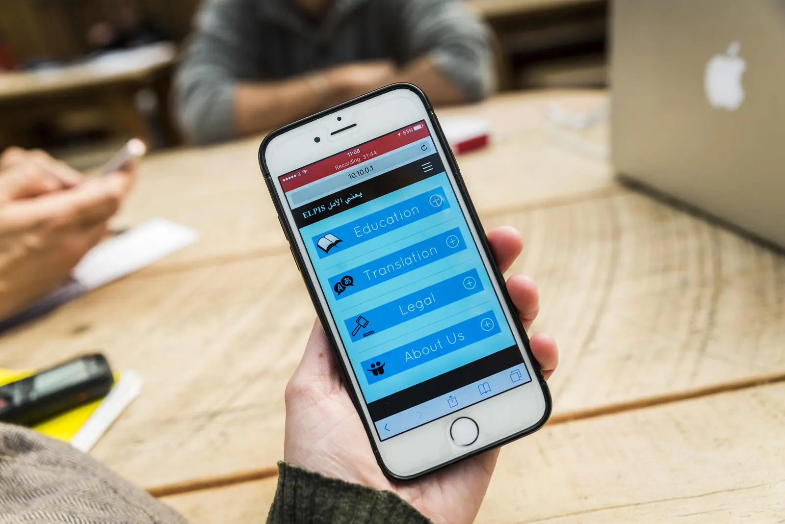

This project is designed to bring knowledge and learning to remote and off-grid areas where internet access is limited.

The idea initially came during repeated visits to refugee camps in Greece during the height of the Syrian refugee crisis in 2015/16, as our team at Elpis Solar was providing support through the installation of solar mobile phone charging systems. We quickly realised that most residents didn't have access to the internet unless they paid for it, and many were asking for WiFi and information, and that’s what triggered this project.

We came up with the idea to use a Raspberry Pi and configure it to act as a Wireless Access Point, making it easy for users to connect and access locally stored content. To serve the content we used the excellent [Kiwix Serve](https://github.com/kiwix/kiwix-tools) server which is an HTTP daemon which serves `ZIM` files.

Kiwix also provides a vast library of `ZIM` files ranging from mirrors of Wikipedia, to collections of educational Youtube videos and many more, which formed our primary content base.

To enhance the user experience, I developed a custom frontend from scratch using `RatchetJs` mobile UI library. The frontend is designed specifically for mobile phone users, offering a clean and intuitive interface. The frontend is available in both English and French, allowing users from diverse backgrounds to access the content.

The idea behind this project is to bring education and learning to remote areas powered by solar systems. By offering a offline educational content server, people can access knowledge and learning resources without needing to rely on an internet connection.

You can find more information on the project in this [article](https://www.unhcr.org/uk/news/stories/2017/7/595e26c74/project-elpis-offers-a-ray-of-hope-in-refugee-camps.html).