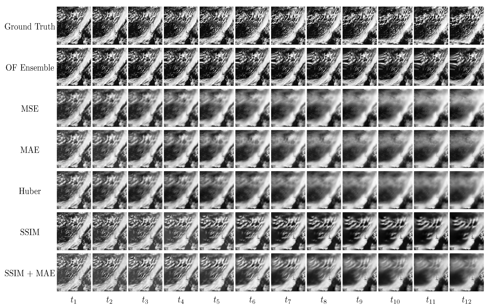

This project aimed to develop an improved method for predicting short-term cloudiness in Europe using a deep learning approach. The approach utilized Convolutional Gated Recurrent Unit Networks (ConvGRUs) and a novel optimization criterion designed to maintain image structure during forecasting. 

The performance of the proposed method was compared against traditional optical flow algorithms using a large dataset collected by a satellite instrument over a 2.5-year period. The results showed that the ConvGRU method outperformed the optical flow algorithms, with an average improvement in accuracy measures such as R2, mean absolute error, and structural similarity. 

The project highlights the benefits of deep learning-based models with locally oriented loss functions in producing accurate cloud forecasts, with applications in the field of solar power forecasting.

You can read the full publication of the work [here](https://www.mdpi.com/2073-4433/13/10/1632)

### Technologies used

- `Xarray`
- `Pytorch`
- `Python`
- `Docker`
- `AWS`
- `Google Cloud`
