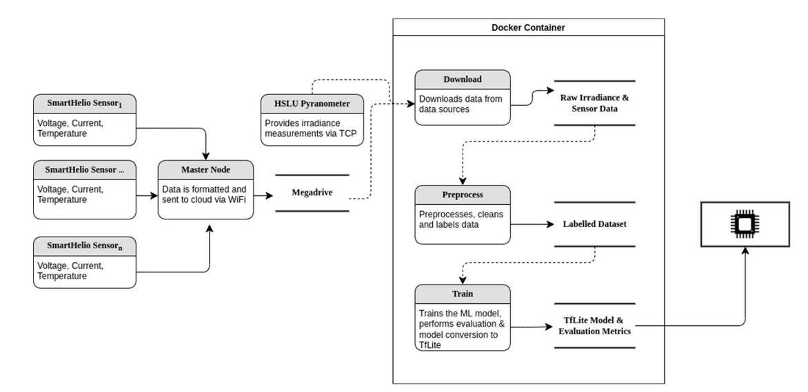

I had the opportunity to work on a fascinating research project aimed at detecting faults in photovoltaic (PV) systems on the edge. The project was carried out at the University of Applied Sciences Luzern in collaboration with SmartHelio, a Y Combinator backed startup with the vision to bring real time fault classification to solar farms around the world.

Solar plants are becoming increasingly popular as a source of renewable energy. However, it is difficult for plant operators to maintain individual solar panels. This can lead to a decline in efficiency over time due to defects. Therefore, there is a need for an efficient way to maintain plant operators assets.

Our solution was to develop an embedded system that uses on-device machine learning to automatically classify faults in the solar panel. Our research goals included developing a plug-and-play IoT sensor for data collection and inference, developing an ML-based fault detection model, and deploying the ML model on the MCU. To achieve these goals, I developed the machine learning pipeline, which involved data downloading, preprocessing, training, and conversion to a deployable model on the MCU. 

My main contribution to the project was leading the development of the machine learning workflow, as well as the building the underlying deep learning model for fault detection, as well as prototyping communications to AWS using MQTT, which allowed us to upload and download predictions in near-realtime.

Overall, the project was a success, and we were able to demonstrate the feasibility of using on-device machine learning to detect faults in PV systems on the edge. Our work has the potential to revolutionize the way solar farms are maintained, making them more efficient and sustainable. If you're interested in learning more, you can find our related presentation [here](https://www.hslu.ch/-/media/campus/common/files/dokumente/ta/ta-forschung/iet/tech-lunch/tech-lunch-smarthelio-slides.pdf?la=de-ch)

### Technologies used

- `Tensorflow Lite for Microcontrollers`
- `AWS IoT Core`
- `MQTT`
- `Docker`
- `Python`
- `C++`