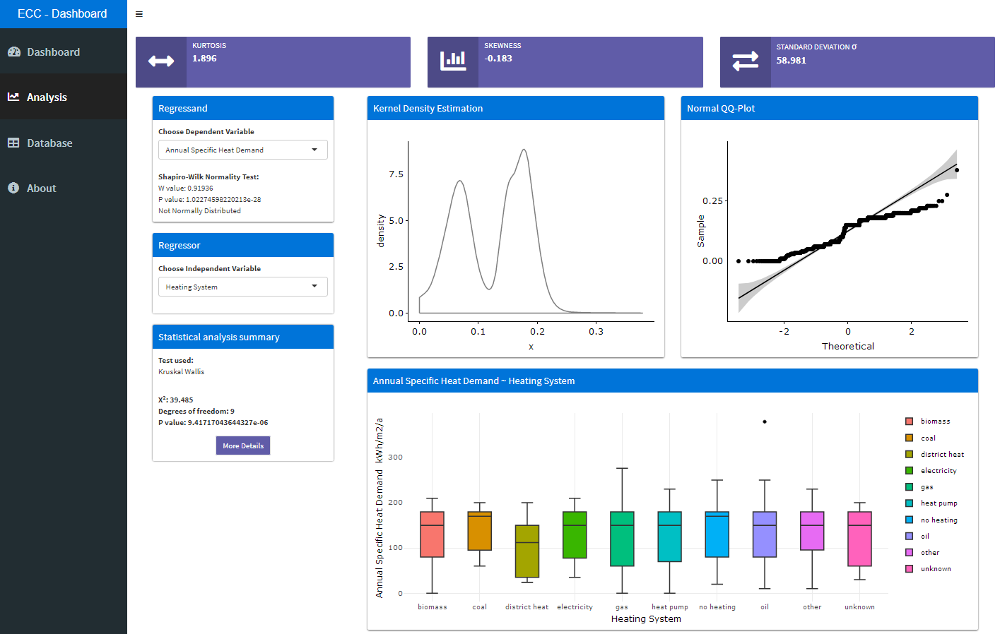
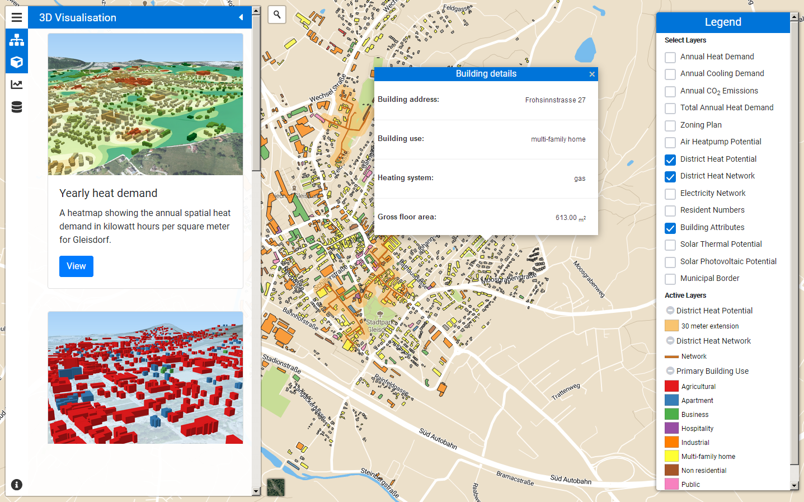

EnergyCityConcepts was an ambitious project aimed at addressing the challenges of climate change and urbanisation by implementing spatial energy planning in the municipality of Gleisdorf and the district of Salzburg Schallmoos. As one of the software engineers involved in the project, my role was to contribute to the technical implementation of the project.

One of my key responsibilities was to process and analyse data using R and Python and to create interactive visualisations. This involved working with large spatial datasets on local energy requirements, energy potentials, and infrastructures to identify patterns and trends. By using statistical models and visualization techniques, we were able to identify key insights that could inform long-term urban planning.

Another critical aspect of the project was the development of the Geodatabase. Using Postgis and PostgreSQL, we created a detailed database that stored all the spatial data collected during the project. This included information on the state of renovation of buildings, distribution and type of heating systems, type of energy sources used, heating demand, and CO2 emissions in the area under consideration.

Finally, I was also involved in the development of the WebGIS application that allowed users to easily visualise and explore the results of the project. This was an important part of the project as it allowed stakeholders to see the impact of different energy planning scenarios on the environment and the local community.

The project's results are impressive, with digital maps that can be intuitively understood and provide important insights for long-term urban planning. For instance, the results showed the suitability and priority areas for district heating supply, potentials for the expansion and integration of biomass, heat pumps, solar thermal and PV systems, and waste heat utilization. The project initiated the process for spatial energy planning in the participating municipalities and won over committed people to the topic, leading to further projects in various areas.

The follow-up project, Spatial Energy Planning, deals with the further development of the elaborated basics, and I am excited to see how this project will contribute to tackling the challenges of climate change and urbanisation in our communities. Overall, the EnergyCityConcepts project was a unique and rewarding experience that demonstrated the value of transdisciplinary collaboration and innovation in addressing critical societal challenges.

For further information on the project see the following [article](https://nachhaltigwirtschaften.at/en/sdz/projects/ecc-energy-city-concepts.php).

### Technologies used

- `LeafletJS`
- `ThreeJS`
- `ShinyR`
- `Python`
- `PostGIS`
- `QGIS`
- `PostgreSQL`